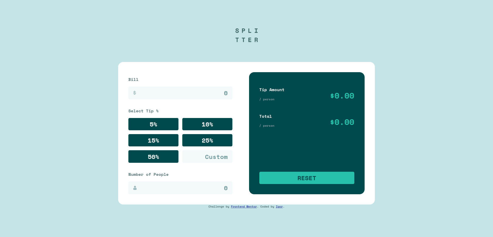

# Frontend Mentor - Tip calculator app solution

This is a solution to the [Tip calculator app challenge on Frontend Mentor](https://www.frontendmentor.io/challenges/tip-calculator-app-ugJNGbJUX). Frontend Mentor challenges help you improve your coding skills by building realistic projects.

## Table of contents

- [Overview](#overview)
  - [The challenge](#the-challenge)
  - [Screenshot](#screenshot)
  - [Links](#links)
- [My process](#my-process)
  - [Built with](#built-with)
  - [What I learned](#what-i-learned)
  - [Continued development](#continued-development)
  - [Useful resources](#useful-resources)
- [Author](#author)


**Note: Delete this note and update the table of contents based on what sections you keep.**

## Overview

### The challenge

Users should be able to:

- View the optimal layout for the app depending on their device's screen size
- See hover states for all interactive elements on the page
- Calculate the correct tip and total cost of the bill per person

### Screenshot



### Links

- Solution URL: [Add solution URL here](https://your-solution-url.com)
- Live Site URL: [Add live site URL here](https://your-live-site-url.com)

## My process

### Built with

- Semantic HTML5 markup
- CSS custom properties
- Flexbox
- Mobile-first workflow


### What I learned

I learn how to use the output html element. How to validate forms with js.

```html
 <p class="display__amount" >$<output class="strong---amount" id="perPerson" >0.00</output></p>
```

```js

function calcTip() {
    if (Tip != undefined && bill != undefined && numP != undefined) {
        console.log(Tip, bill, numP);
        let total = bill * Tip;
        let splitTip = total / numP;
        document.querySelector("#totalTip").innerText = total.toFixed(2);
        document.querySelector("#perPerson").innerText = splitTip.toFixed(2);
        let reset = document.querySelector(".btn---reset");
        reset.disabled = false;
    } 
}
```


### Continued development

I will continue to practice writing readable code, learn more about js, and learn more about html elements.

### Useful resources

- [MDN validation](https://developer.mozilla.org/en-US/docs/Learn/Forms/Form_validation#the_constraint_validation_api) - How to use js to validate forms.
- [MDN<output>](https://developer.mozilla.org/en-US/docs/Web/HTML/Element/output) - Helped me with output element.

## Author


- Frontend Mentor - [@Radasin](https://www.frontendmentor.io/profile/Radasin)

